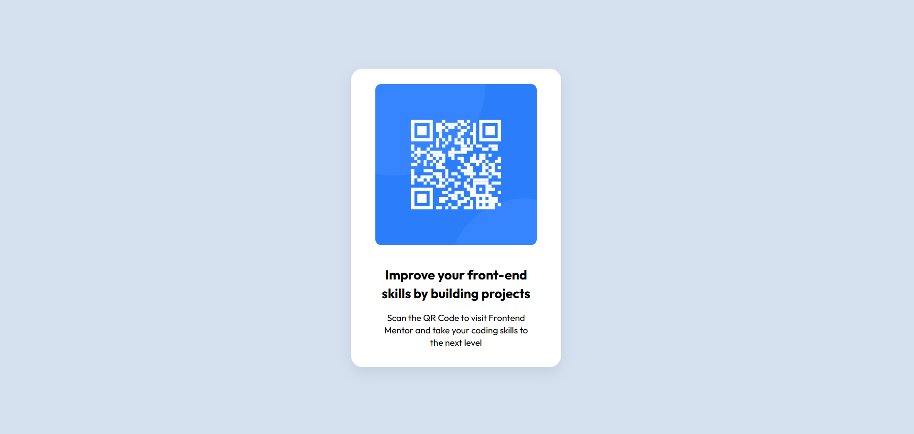

# Frontend Mentor - QR code component solution

This is a solution to the [QR code component challenge on Frontend Mentor](https://www.frontendmentor.io/challenges/qr-code-component-iux_sIO_H). Frontend Mentor challenges help you improve your coding skills by building realistic projects.

## Overview

### Screenshot

### Links
Solution URL:
Live URL:
## My Process
### Built with
Semantic HTML 5
CSS Properties
Flexbox
### What I learnt
How to use Flexbox for alignment
The shadow property
How to use Google Fonts in HTML by linking in the head of the file
How to use the div element and class attribute to differentiate them
How to use the relative path for images
How to style your CSS file in order from layout,box model,styles & visuals
How to check responsiveness using DevTools

### Continued development
Understand CSSGrid layout - https://css-tricks.com/snippets/css/complete-guide-grid/

### Useful Resources
https://css-tricks.com/snippets/css/a-guide-to-flexbox/ -This article helped me understand Flexbox.
https://css-tricks.com/quick-whats-the-difference-between-flexbox-and-grid/ -This article helped me understand the difference between CSSGrid and Flexbox

## Author
Charity Karoki
## Acknowledgements
Front-end Mentor - https://www.frontendmentor.io/challenges/qr-code-component-iux_sIO_H
